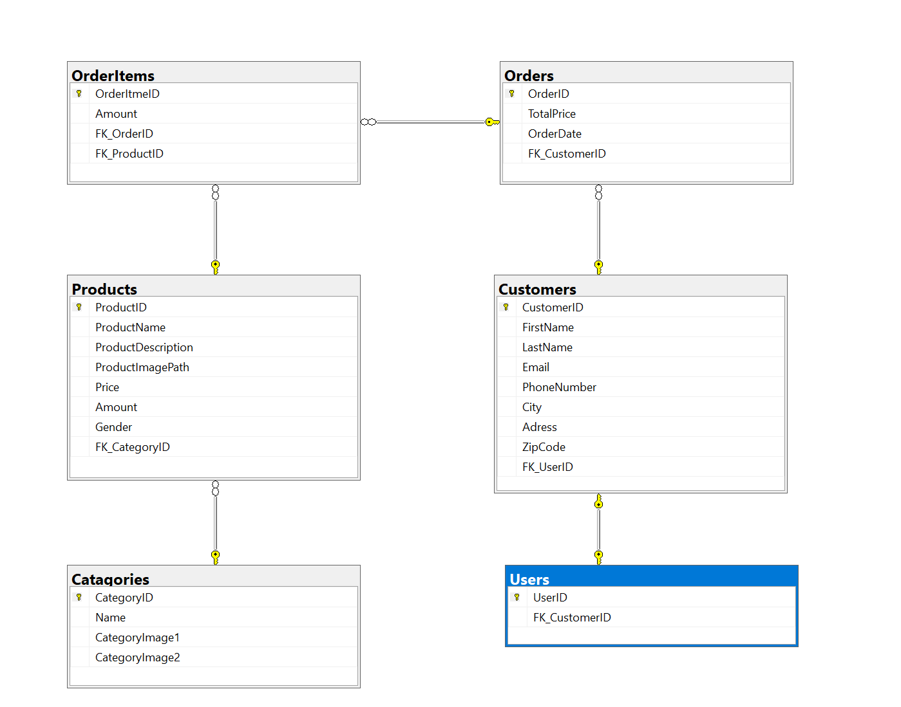

# Off-Black

## Introduction / Motivation

The reason for making this project is to develop skils in LINQ, SQL, DotNET, and EF Core

## Technical Details

**FBT** : Folder By Type  
**FBF** : Folder By Feature  

|Project Name|Language|Folder Structure|
|-|-|-|
|**|* *|*FBF*|
|*Off-Black.Service*|*.Net 5.0*|*FBT*|
|*Off-Black.Repository*|*.Net 5.0*|*FBT*| 

### Technologies and prerequisites

- [Visual Studio 2019](https://visualstudio.microsoft.com/vs/)
- [ASP.Net 5.0](https://docs.microsoft.com/en-us/aspnet/core/getting-started/?view=aspnetcore-5.0&tabs=windows)
- [Entity Framework Core](https://docs.microsoft.com/en-us/ef/core/)
- [Razor Pages](https://www.learnrazorpages.com/)
- [Log4Net](https://logging.apache.org/log4net/)
- [xUnit](https://docs.microsoft.com/en-us/ef/core/testing/in-memory)
- Basic knowledge of VSTS, GIT and LINQ

## Physical Architecture

## Solution Architecture

This solution is realized as a DotNET 5.0 project.

The solution is built with a 3-tier architecture. It starts with a presentation layer, and for this case it is the web layer. 
This layer calls down to the service layer with all the business logic, without presentation layer specific code. 
The next layer is the repository that handles the database and sql execution, and it is only accessible by the service layer. 
But there is a little flaw in this design, and it means that the presentation layer also have access to the repository, 
because it is needed for dependency injection in [Startup.cs](Proje/Startup.cs)

## ER-Diagram

## Deployment

1. Open the project in Visual Studio and publish **Project**
2. Select "**IIS, FTP, etc**" when prompted for a publish target and use the following options:

- Publish method: File System.
- Target location: Create a new folder and use it as the target
- Configuration: Release
- Target Framework: netcoreapp5.0
- Deployment Mode: Self-Contained
- Target Runtime: win-x64

Copy the files to the IIS Server's share, after the publish is finished.

## Use of third party libraries

|Library|Version|
|-|-|
|Automapper|10.1.1|
|Coverlet.collector|3.0.2|
|FluentNHibernate|3.1.0|
|Log4Net|2.0.12|
|Microsoft.EntityFrameworkCore.InMemory|5.0.10|
|Microsoft.EntityFrameworkCore.SqlServer|5.0.10|
|Microsoft.EntityFrameworkCore.Tools|5.0.10|
|Microsoft.EntityFrameworkCore.Console|5.0.0|
|Microsoft.NET.Test.SDK|16.9.4|
|XUnit|2.4.1|
|XUnit Runner|2.4.3|

## Responsible People  

|Name|E-mail|Role|
|-|-|-|
|Peter Hymoller|Peter.hymoller@danfoss.com|Developer|